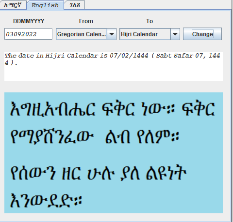

# Calendar-Converter

Calendar Converter enables to convert dates in Ethiopian, European, and Hijri calendars from one to another.
  
## How to use the app:
To convert a date insert the date in the first box in the order date, month and year (8 digits) and choose from which
calendar (first dropdown box) to which calendar (second dropdown box) you want to change and press the 'Change' button.

## Technologies used

- Java 8
- Netbean

## Author

👤 **Desta Legesse Wubishet**

- GitHub: https://github.com/dlwub
- Twitter: [@DestaWubishet](https://twitter.com/DestaWubishet)
- LinkedIn: https://www.linkedin.com/in/desta-legesse-w-509844213/

Give a ⭐️ if you like this project!

&copy; 2016 All rights reserved.
